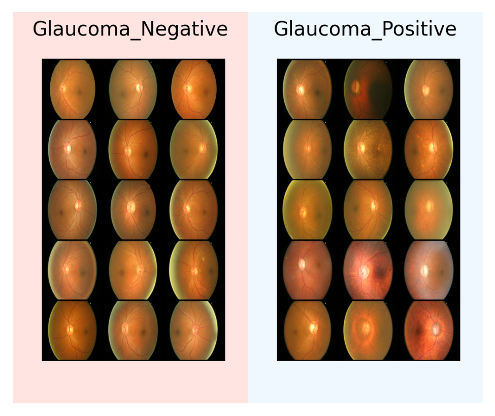
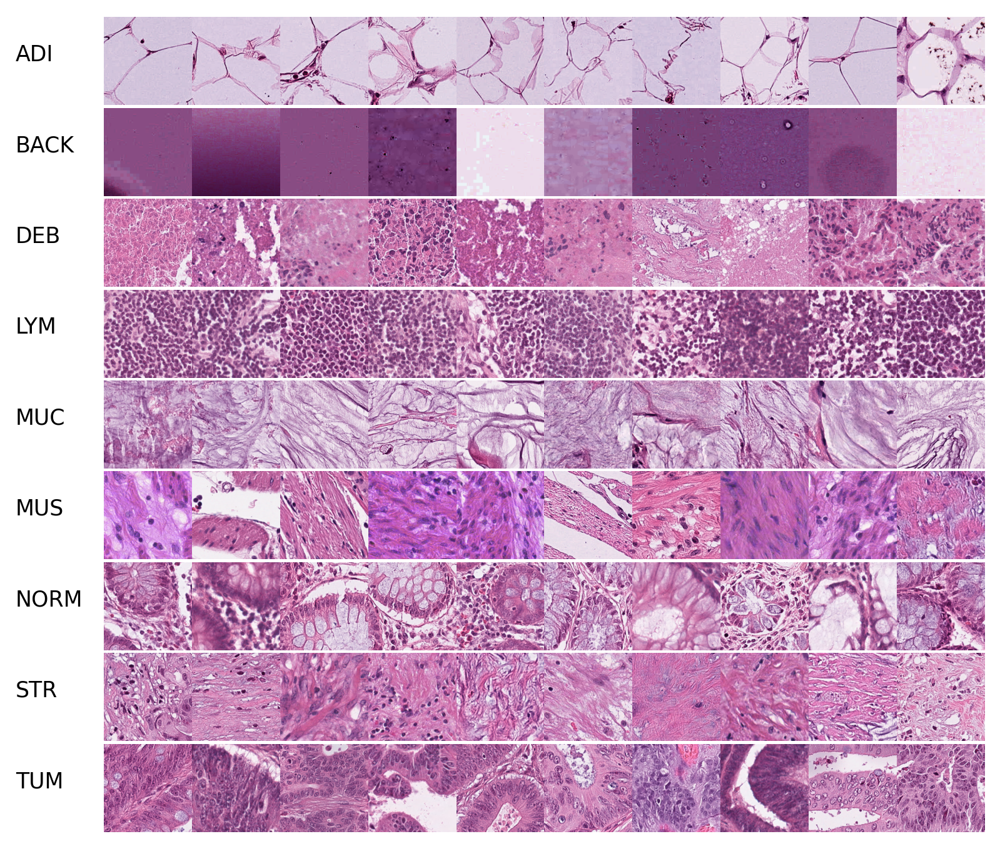

# 2d medical classification data

## Description

This project supports the visualization of dozens of medical datasets from various open-source platforms in the medical field. and these datasets come from different modalities. We have compiled these datasets and visualized them using a unified format, which helps researchers to quickly understand medical-related data through visualization.

## Visualization

### colposcopy
intel_mobileodt_cervical_cancer_screening

### ct_2d
covid_ct

### dermoscopy
derm7pt

### endoscopy
aida_e_1

aida_e_2

kvasir

### fundus_photography
adam

aptos_2019_blindness_detection

cataract_detection

glaucoma

### histopathology
crc100k

gleason

hep_2_6

lc25000

malaria_detection

### microscopy_images
blood_cell_images

hushem

### mr_2d
br35h

### x_ray
chest_x_ray

covid19_image_dataset

covid19_radiodata

covidgr
