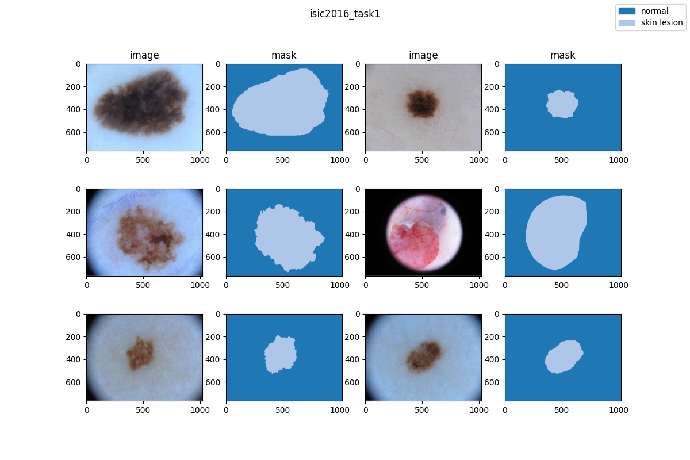
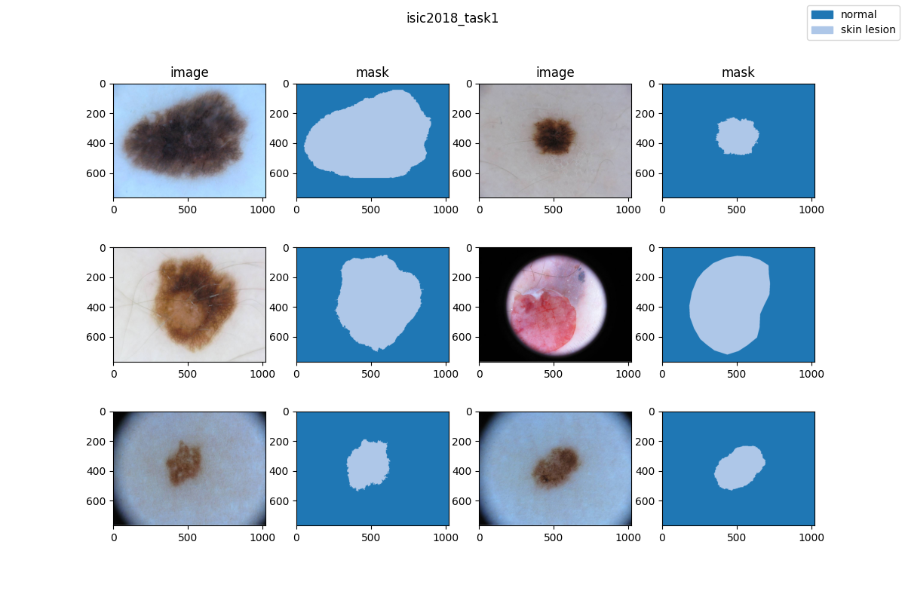
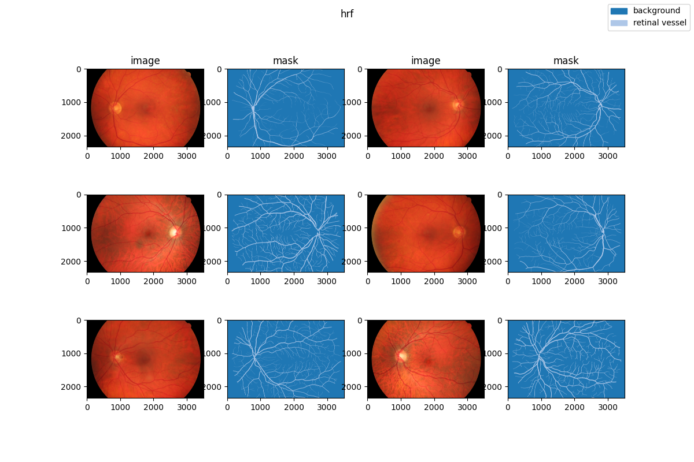
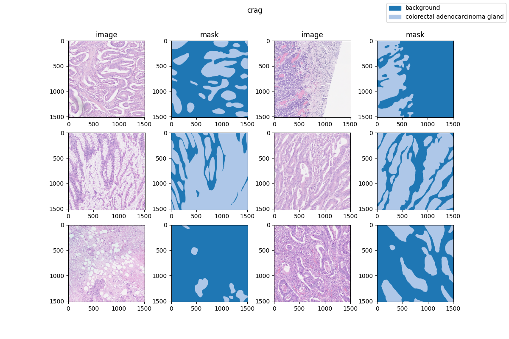

# 2d semantic segmentation data

## Description

This project supports the visualization of dozens of medical datasets from various open-source platforms in the medical field, and these datasets come from different modalities. We have compiled these datasets and visualized them using a unified format, which helps researchers to quickly understand medical-related data through visualization.

## Visualization

### CT

### dermoscopy

### endoscopy

### fluorescein_angriogram

### fundus_photography

### histopathology

                              
                      
### infrared_reflectance_imaging

### microscopy_images

### ophthalmoscope

### ultrasound

### x_ray

